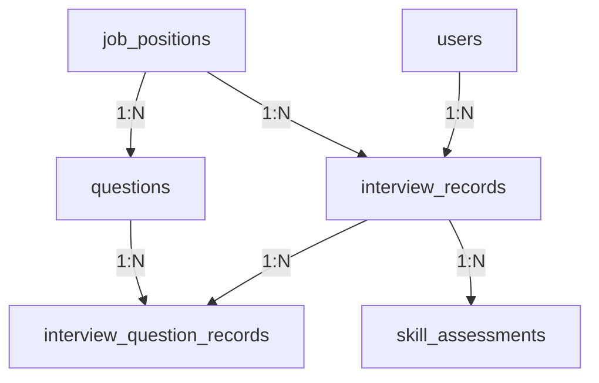

```sql
数据库设计


-- 创建数据库
CREATE DATABASE IF NOT EXISTS interview CHARACTER SET utf8mb4 COLLATE utf8mb4_unicode_ci;
USE interview;

-- 用户表
CREATE TABLE users (
    id INT PRIMARY KEY AUTO_INCREMENT,
    username VARCHAR(50) UNIQUE NOT NULL COMMENT '学号/用户名',
    password VARCHAR(255) NOT NULL COMMENT '密码哈希',
    real_name VARCHAR(50) COMMENT '真实姓名',
    email VARCHAR(100) COMMENT '邮箱',
    phone VARCHAR(20) COMMENT '手机号',
    major VARCHAR(100) COMMENT '专业',
    grade VARCHAR(20) COMMENT '年级',
    avatar_url VARCHAR(255) COMMENT '头像URL',
    created_at TIMESTAMP DEFAULT CURRENT_TIMESTAMP,
    updated_at TIMESTAMP DEFAULT CURRENT_TIMESTAMP ON UPDATE CURRENT_TIMESTAMP
);

-- 岗位表
CREATE TABLE job_positions (
    id INT PRIMARY KEY AUTO_INCREMENT,
    name VARCHAR(100) NOT NULL COMMENT '岗位名称',
    description TEXT COMMENT '岗位描述',
    difficulty ENUM('初级', '中级', '高级') DEFAULT '中级',
    duration INT DEFAULT 60 COMMENT '预计面试时长(分钟)',
    icon VARCHAR(50) COMMENT '图标名称',
    is_active BOOLEAN DEFAULT TRUE,
    created_at TIMESTAMP DEFAULT CURRENT_TIMESTAMP
);

-- 面试记录表
CREATE TABLE interview_records (
    id INT PRIMARY KEY AUTO_INCREMENT,
    user_id INT NOT NULL,
    job_position_id INT NOT NULL,
    score INT DEFAULT 0 COMMENT '总分',
    duration_minutes INT COMMENT '实际用时(分钟)',
    status ENUM('进行中', '已完成', '已中断') DEFAULT '进行中',
    start_time TIMESTAMP DEFAULT CURRENT_TIMESTAMP,
    end_time TIMESTAMP NULL,
    summary TEXT COMMENT '面试总结',
    created_at TIMESTAMP DEFAULT CURRENT_TIMESTAMP,
    FOREIGN KEY (user_id) REFERENCES users(id) ON DELETE CASCADE,
    FOREIGN KEY (job_position_id) REFERENCES job_positions(id)
);

-- 问题库表
CREATE TABLE questions (
    id INT PRIMARY KEY AUTO_INCREMENT,
    job_position_id INT NOT NULL,
    type ENUM('behavioral', 'technical', 'coding', 'scenario') NOT NULL,
    title VARCHAR(500) NOT NULL,
    description TEXT,
    difficulty INT DEFAULT 3 COMMENT '难度等级1-5',
    hint TEXT COMMENT '提示信息',
    code_template TEXT COMMENT '代码模板',
    tags JSON COMMENT '标签数组',
    is_active BOOLEAN DEFAULT TRUE,
    created_at TIMESTAMP DEFAULT CURRENT_TIMESTAMP,
    FOREIGN KEY (job_position_id) REFERENCES job_positions(id)
);

-- 面试问题记录表
CREATE TABLE interview_question_records (
    id INT PRIMARY KEY AUTO_INCREMENT,
    interview_record_id INT NOT NULL,
    question_id INT NOT NULL,
    question_order INT NOT NULL COMMENT '问题顺序',
    answer_text TEXT COMMENT '文本回答',
    answer_code TEXT COMMENT '代码回答',
    programming_language VARCHAR(50) COMMENT '编程语言',
    audio_file_path VARCHAR(255) COMMENT '录音文件路径',
    score INT DEFAULT 0 COMMENT '单题得分',
    time_spent INT COMMENT '答题用时(秒)',
    is_skipped BOOLEAN DEFAULT FALSE,
    created_at TIMESTAMP DEFAULT CURRENT_TIMESTAMP,
    FOREIGN KEY (interview_record_id) REFERENCES interview_records(id) ON DELETE CASCADE,
    FOREIGN KEY (question_id) REFERENCES questions(id)
);

-- 技能评估表
CREATE TABLE skill_assessments (
    id INT PRIMARY KEY AUTO_INCREMENT,
    interview_record_id INT NOT NULL,
    skill_name VARCHAR(100) NOT NULL,
    score INT NOT NULL COMMENT '技能得分',
    created_at TIMESTAMP DEFAULT CURRENT_TIMESTAMP,
    FOREIGN KEY (interview_record_id) REFERENCES interview_records(id) ON DELETE CASCADE
);

-- 插入岗位数据
INSERT INTO job_positions (name, description, difficulty, duration, icon) VALUES
('前端开发工程师', 'Vue.js、React、JavaScript等前端技术栈面试', '中级', 30, 'Monitor'),
('后端开发工程师', 'Java、Python、数据库等后端技术面试', '中级', 45, 'Server'),
('人工智能工程师', '机器学习、深度学习、算法等AI技术面试', '高级', 60, 'Cpu'),
('大数据工程师', 'Hadoop、Spark、数据处理等大数据技术面试', '高级', 50, 'DataAnalysis'),
('产品经理', '产品设计、用户体验、项目管理等综合面试', '中级', 40, 'Management'),
('UI/UX设计师', '界面设计、用户体验、设计工具等设计面试', '初级', 35, 'Brush');

-- 插入示例问题（人工智能工程师）
INSERT INTO questions (job_position_id, type, title, description, difficulty, hint, tags) VALUES
(3, 'behavioral', '请简单介绍一下您自己', '请用3-5分钟的时间介绍您的教育背景、技能特长、项目经验以及为什么对这个岗位感兴趣。', 2, '可以按照教育背景 → 技能特长 → 项目经验 → 职业目标的顺序来组织回答', '["自我介绍", "基础问题"]'),
(3, 'technical', '什么是机器学习？请解释监督学习和无监督学习的区别', '请详细解释机器学习的概念，并说明监督学习和无监督学习的主要区别，各自的应用场景。', 3, '可以从定义、数据特点、算法类型、应用场景等角度来对比', '["机器学习", "基础概念"]'),
(3, 'coding', '实现一个简单的线性回归算法', '请用您熟悉的编程语言实现一个简单的线性回归算法，包括训练和预测功能。', 4, '可以使用梯度下降法来优化参数，注意处理数据的标准化', '["算法实现", "线性回归"]'),
(3, 'scenario', '如何处理数据不平衡问题？', '在实际项目中，经常会遇到数据不平衡的问题。请描述您会如何识别和解决这类问题。', 4, '可以从数据层面、算法层面、评估层面来考虑解决方案', '["数据处理", "实际应用"]'),
(3, 'behavioral', '描述一次您解决技术难题的经历', '请详细描述一次您在项目中遇到技术难题并成功解决的经历，包括问题的背景、解决过程和最终结果。', 3, '可以使用STAR法则来组织回答：情境、任务、行动、结果', '["问题解决", "项目经验"]');
```


- 用户管理 ：扩展的用户表，支持完整的用户信息
- 岗位管理 ：动态的岗位配置
- 面试记录 ：完整的面试过程记录
- 问题库 ：灵活的问题管理系统
- 答题记录 ：详细的答题过程和结果
- 技能评估 ：多维度的能力评估


### 数据库表关系图



### 表关系说明

| 表名              | 关系类型 | 关联表                     | 关键字段                 | 作用说明                     |
| ----------------- | -------- | -------------------------- | ------------------------ | ---------------------------- |
| users             | 1:N      | interview_records          | id → user_id             | 用户可进行多次面试           |
| job_positions     | 1:N      | interview_records          | id → job_position_id     | 每个岗位对应多个面试记录     |
| job_positions     | 1:N      | questions                  | id → job_position_id     | 每个岗位有多个关联问题       |
| interview_records | 1:N      | interview_question_records | id → interview_record_id | 单次面试包含多个问题记录     |
| interview_records | 1:N      | skill_assessments          | id → interview_record_id | 单次面试生成多个技能评估项   |
| questions         | 1:N      | interview_question_records | id → question_id         | 问题可被多次使用在不同面试中 |

---

### 数据表说明书

#### 1. users（用户表）
**核心用途**：用户身份认证和基础信息管理  
**使用场景**：

- 用户注册/登录
- 个人中心信息管理
- 面试记录归属
**关键字段**：
```sql
username VARCHAR(50) UNIQUE  -- 登录账号（学号）
password VARCHAR(255)        -- 加密密码
real_name VARCHAR(50)        -- 实名信息
```

#### 2. job_positions（岗位表）
**核心用途**：定义面试岗位元数据  
**使用场景**：
- 面试岗位选择界面
- 问题分类管理
- 面试流程配置
**关键字段**：
```sql
name VARCHAR(100)       -- 岗位名称（前端/后端/AI等）
difficulty ENUM         -- 难度等级
duration INT            -- 默认面试时长
icon VARCHAR(50)        -- 前端展示图标
```

#### 3. interview_records（面试记录表）
**核心用途**：面试过程主记录  
**使用场景**：
- 开始新面试
- 面试历史记录查看
- 面试报告生成
**关键字段**：
```sql
status ENUM             -- 进行中/已完成/已中断
start_time TIMESTAMP    -- 开始时间
end_time TIMESTAMP      -- 结束时间
score INT               -- 总分（0-100）
summary TEXT            -- AI生成的总结报告
```

#### 4. questions（问题库表）
**核心用途**：存储面试题库  
**使用场景**：
- 面试问题随机抽取
- 问题管理后台
- 问题标签筛选
**关键字段**：
```sql
type ENUM               -- 问题类型（behavioral/technical等）
title VARCHAR(500)      -- 问题标题
difficulty INT          -- 难度系数（1-5）
tags JSON               -- 技能标签["机器学习","算法"]
```

#### 5. interview_question_records（面试问题记录表）
**核心用途**：记录单次面试中的问答详情  
**使用场景**：
- 面试实时答题
- 答案存储（文字/代码/语音）
- 单题评分
**关键字段**：
```sql
answer_text TEXT        -- 文本答案
answer_code TEXT        -- 代码答案
audio_file_path VARCHAR(255) -- 语音路径
score INT               -- 单题得分
time_spent INT          -- 答题用时(秒)
```

#### 6. skill_assessments（技能评估表）
**核心用途**：多维能力分析报告  
**使用场景**：
- 生成雷达图数据
- 技能短板分析
- 学习建议生成
**关键字段**：
```sql
skill_name VARCHAR(100) -- 技能项（算法/沟通/工程）
score INT               -- 单项得分（0-10）
```

---

### 接口开发使用指南

#### 用户认证流程
```mermaid
sequenceDiagram
    前端->>+后端： 提交 username/password
    后端->>users表： 验证账号密码
    后端-->>前端： 返回 session/jwt
```

#### 开始新面试
```mermaid
sequenceDiagram
    前端->>+后端： 提交 job_position_id
    后端->>interview_records： 创建新记录(status=进行中)
    后端->>questions： 随机抽取5个问题
    后端-->>前端： 返回 interview_id + 问题列表
```

#### 答题过程
```mermaid
sequenceDiagram
    前端->>+后端： 提交 interview_id + question_id + 答案
    后端->>interview_question_records： 存储答案
    后端->>AI服务： 请求评分
    后端-->>前端： 返回实时评分
```

#### 结束面试
```mermaid
sequenceDiagram
    前端->>+后端： 请求结束 interview_id
    后端->>interview_records： 更新状态/结束时间
    后端->>skill_assessments： 生成技能评估
    后端-->>前端： 返回完整报告
```

#### 历史记录查询
```sql
/* 获取用户历史面试 */
SELECT r.*, p.name AS job_name 
FROM interview_records r
JOIN job_positions p ON r.job_position_id = p.id
WHERE r.user_id = {user_id}

/* 获取单次面试详情 */
SELECT q.title, iqr.* 
FROM interview_question_records iqr
JOIN questions q ON iqr.question_id = q.id
WHERE iqr.interview_record_id = {record_id}
```

#### 数据看板接口
```sql
/* 用户技能雷达图数据 */
SELECT skill_name, AVG(score) as avg_score
FROM skill_assessments
WHERE interview_record_id IN (
  SELECT id FROM interview_records WHERE user_id = {user_id}
)
GROUP BY skill_name
```

---

### 开发注意事项
1. **事务处理**：
   - 开始面试时需原子化操作：创建interview_records + 生成问题记录
   - 结束面试时：更新主记录 + 生成技能评估 + 计算总分
2. **性能优化**：
   - 面试进行中：使用Redis缓存实时答题数据
   - 历史记录查询：添加分页机制 LIMIT 20 OFFSET ?
3. **数据一致性**：
   - 删除用户时：CASCADE删除关联面试记录
   - 禁用岗位/问题时：标记is_active=False不物理删除